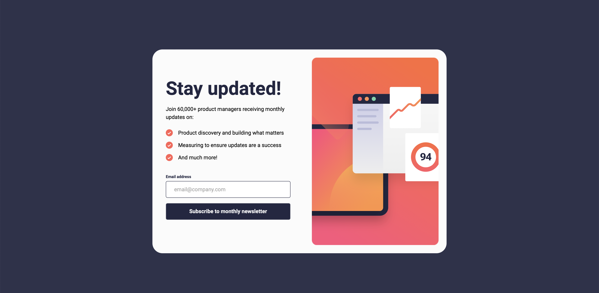
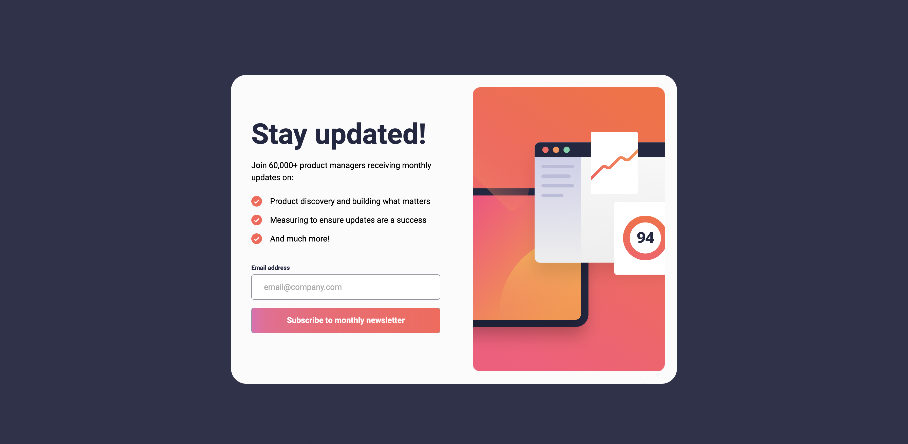
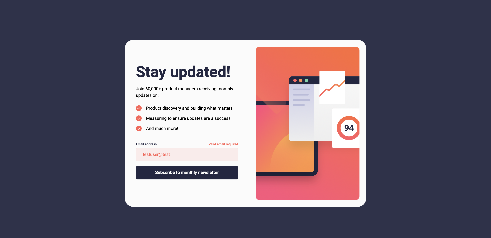
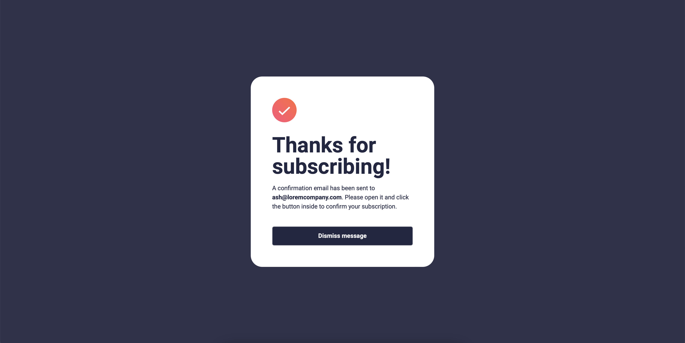

## About me

- LinkedIn - [Felipe Stefani](https://www.linkedin.com/in/felipe-stefani-a35185116/)
- Instagram - [@felipestefani](https://www.instagram.com/felipestefani/)
- Frontend Mentor - [@felipestefani](https://www.frontendmentor.io/profile/felipestefani)


# Frontend Mentor - Newsletter sign-up form with success message solution

This is a solution to the [Newsletter sign-up form with success message challenge on Frontend Mentor](https://www.frontendmentor.io/challenges/newsletter-signup-form-with-success-message-3FC1AZbNrv). Frontend Mentor challenges help you improve your coding skills by building realistic projects. 

## Table of contents

- [Overview](#overview)
  - [The challenge](#the-challenge)
  - [Screenshot](#screenshot)
  - [Links](#links)
- [My process](#my-process)
  - [Built with](#built-with)
  - [What I learned](#what-i-learned)
  - [Continued development](#continued-development)
- [Author](#author)


## Overview

### The challenge

Users should be able to:

- Add their email and submit the form
- See a success message with their email after successfully submitting the form
- See form validation messages if:
  - The field is left empty
  - The email address is not formatted correctly
- View the optimal layout for the interface depending on their device's screen size
- See hover and focus states for all interactive elements on the page

### Screenshot

Mobile design hasn't screenshots, but it also works!






### Links

- Solution URL: [https://github.com/felipestefani/newsletter-sign-up](https://github.com/felipestefani/newsletter-sign-up)
- Live Site URL: [https://felipestefani.github.io/newsletter-sign-up/](https://felipestefani.github.io/newsletter-sign-up/)

## My process

I'm fixing vue contents, that way I chose to develop this simple project applying what I know!
I've started with desktop design and then go to the mobile.

### Built with

- Semantic HTML5 markup
- CSS custom properties
- Flexbox
- Vue composition API
- [Vue](https://vuejs.org) - Vue framework 

### What I learned

How said before, i'm fixing vue contents and I've learned many things too.
I've used vue-router to redirect to new pages and create a function that checks the width of screen, like the following code block:

```js
  const useWindowSize = () => {
    const width = ref(window.innerWidth)
    const updateSize = () => {
      width.value = window.innerWidth
    }

    onMounted(() => {
      window.addEventListener('resize', updateSize)
    })

    onUnmounted(() => {
      window.removeEventListener('resize', updateSize)
    })

    return width
  }
```

### Continued development

I'm going to be focus on vue framework on next projects, to realy go deep and master it.
I already work with react and therefore gonna still work with this library too, to don't forget any concept!

I'm always open to new ideas to improve my code skills, so... anyone who wants to contribute with me, I'll be gladly!


## Author

- LinkedIn - [Felipe Stefani](https://www.linkedin.com/in/felipe-stefani-a35185116/)
- Instagram - [A@felipestefani](https://www.instagram.com/felipestefani/)
- Frontend Mentor - [@felipestefani](https://www.frontendmentor.io/profile/felipestefani)

